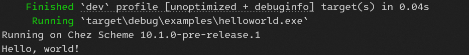
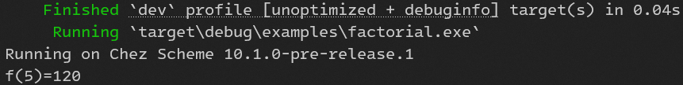

# racket-sys

[](https://crates.io/crates/racket-sys)

Low level Racket language bindings for Rust

About Racket:
[https://racket-lang.org/](https://racket-lang.org/).

## Prerequisites:

- Base env: `Rust` toolchain, `Clang` toolchain and `Racket` installation
- Windows: `Visual Studio`
- MacOS: `Xcode CommandLine tools`, `iconv`, `ncurses`
- Linux:
  - Only tested on Ubuntu 24.04
  - `sudo apt install racket libncurses-dev`, `liblz4-dev`, `libzstd-dev`

## Installation:

### Use bundled Racket (default feature):

This crate includes a prebuilt Racket runtime for Windows, MacOS, and Linux.

- For Windows and MacOS, the bundled Racket 8.13 comes from official Racket distribution.
- For Linux, the bundled Racket 8.10 comes from Ubuntu APT.

### Use system Racket:

Set environment variables (see below):

- `RACKET_CS_VERSION`: Only for MacOS. If not set, default to `8.13`.

- `RACKET_CS_HOME`: Racket installation directory. If not set, default to:
  - Windows: `C:\Program Files\Racket`
  - MacOS: `/Applications/Racket v{RACKET_CS_VERSION}`
  - Linux: `/usr`

## Examples:

- helloworld [examples/helloworld.rs](examples/helloworld.rs):

  ```
  cargo run --example helloworld
  ```

  screenshot on Windows:

  

- factorial [examples/factorial.rs](examples/factorial.rs) and [examples/factorial.rkt](examples/factorial.rkt):

  This example demos how to require Racket module from Rust code.

  ```
  cargo run --example factorial
  ```

  screenshot on Windows:

  

  Note: set env variable `RKT_COLLECTS_DIR` to `racket installation/collects`. For example, on MacOS:

  ```
  RKT_COLLECTS_DIR=/Applications/Racket\ v8.13/collects cargo run --example factorial
  ```

Read [https://docs.racket-lang.org/inside/cs-embedding.html](https://docs.racket-lang.org/inside/cs-embedding.html) for more information on how to embed Racket in your application.
